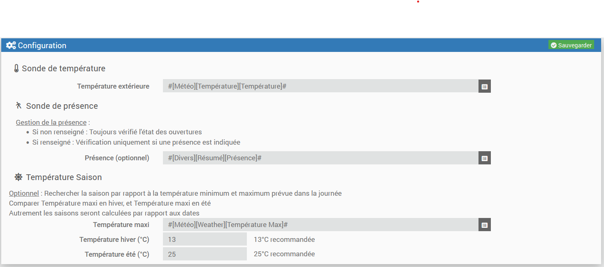

# Plugin template

Plugin permettant de créer une gestion des ouvrants et de déclencher des actions (commande ou scénario).

# Introduction

## Température

Pour éviter une augmentation de l'humidité relative, l'apparition de moisissures, de spores de champignons ou bien la rétention d'allergènes ou de produits chimiques polluants, les médecins recommandent d'aérer sa maison entre 15 et 30 minutes par jour. Mieux vaut le faire en plusieurs fois, en début ou en fin de jour, aux heures où la pollution extérieure est la plus faible.
Source : Futura Sciences

Il suffit d’ouvrir grand les fenêtres pendant 5 à 10 minutes par jour, le matin directement après votre réveil par exemple.
Certaines heures sont défavorables par rapport à la qualité de l’air, surtout en ville :
L’hiver, évitez d’ouvrir vos fenêtres entre 14h et 18h. Aérez votre logement entre 8h et 11h le matin ou entre 22h et minuit le soir.
Concernant l’été, évitez d’ouvrir vos fenêtres entre 11h et 17h. L'aération de votre logement est préférable entre 21h et 10h, quand l’air est le plus frais.
Source : CompteCO2

5 à 10 minutes, 2 à 3 fois par jour, suffisent pour faire entrer de l’air frais et sain et à évacuer l’air chaud et vicié. Sans perte de chaleur ! En si peu de temps, les murs n’ont pas le temps de refroidir, seul l’air circule. Mieux vaut ouvrir en grand 10 minutes que laisser une fenêtre ouverte en oscillo-battant toute la journée en hiver.
L’hiver, la pollution extérieure est au plus haut entre 14 h et 18h. Bref, évitez d’aérer à ce moment-là. Préférez le matin entre 8 h et 11 h ou le soir après 22 h, histoire de dormir dans un environnement sain.
Lorsqu’il fait plus chaud, comme en été, l’idéal est d’aérer entre 21h et 10h lorsque l’air est plus frais. On évite entre 11h et 17h.
Source : Engie 

## CO2

Mesurer la concentration de CO2 est donc un moyen pour mieux aérer les locaux en indiquant quand l'aération est nécessaire. C'est une mesure standard, utilisée actuellement dans certaines constructions modernes pour contrôler le fonctionnement des ventilations mécaniques (VMC). Une mesure, basée sur une réaction chimique,  a été utilisée dès le 19ème siècle pour lutter contre les épidémies respiratoires dans les habitats insalubres. La concentration en CO2 de l'air extérieur est d'environ 0,04%, usuellement noté 400 ppm (partie par millions). Le lien entre la qualité de l'air d'une pièce et la concentration en CO2 est donnée par les valeurs caractéristiques suivantes :

**< 800 ppm** : correspond à une qualité d'air excellente selon la norme NF EN 13779 et c'est une recommandation du Haut Conseil de la Santé publique. Cela constitue donc une valeur "cible" à atteindre.
**entre 800 et 1000 ppm** : correspond à une qualité d'air moyenne selon la norme NF EN 13779.
**entre 1000 et 1500 ppm** : correspond à une qualité d'air modérée selon la norme NF EN 13779. Cela correspond à des valeurs trop élevées en contexte Covid-19.
**> 1500 ppm** : correspond à une qualité d'air basse selon la norme NF EN 13779. Cela correspond à des valeurs beaucoup trop élevées en contexte Covid-19.

Source : projetco2

# Règles retenues 

Si la valeur de présence est 0, alors il n'y aura pas de vérification ni d'action réalisée.

Les actions seront réalisées selon la saison.

HIVER :
- Ouvrir si temp. int < temp. ext.
- Fermer sur durée et temp. int < consigne
- Fermer si temp. int. <= temp. Mini. (consigne - seuil) quel que soit la durée

ETE :
- Ouvrir température ext. < temp. int.
- Fermer sur durée

INTERMEDIAIRE : 
- Fermer si temp. int. < temp. Mini. (consigne - seuil hiver) quelque soit la durée

TOUTES SAISONS :
- Ouvrir si taux co2 >= seuil maxi co2
- Laisser ouvert si taux co2 >= seuil normal co2

# Configuration du plugin

La configuration est très simple, après téléchargement du plugin, il vous suffit de renseigner quelques sondes.

Sonde de température
- Température extérieure : Commande pour la température extérieure

Sonde de présence
- Présence : ce champ est optionnel
    Si le champ est non renseigné : le plugin vérifiera toujours l'état des ouvertures
    Si le champ est renseigné : le plugin vérifiera uniquement si la présence est à 1

Température Saison
- Température Saison : section optionnelle
  Le plugin cherche à réguler la température par rapport à la saison
  La saison est calculée par rapport à la date, ou mieux selon la température maxi selon la météo.
  En effet, il peut y avoir des périodes plus chaudes en hiver, et la règle doit s'adapter pour profiter de ces moments plus chauds.

- Température maxi : Commande du plugin météo indiquant la température maximum du jour
- Température hiver (°C) : température minimum indiquant que le calcul passe sur le mode Hiver (13°C par défaut)
- Température été (°C) : température minimum pour l'Eté (25°C par défaut)

S'il n'y a pas de température renseignée, alors le calcul se base sur les dates :
- Hivers : jour compris entre le 21 septembre et le 21 mars (période plus ou moins fraiche)
- Eté : jour entre le 21 juin et le 21 septembre (période plus ou moins chaude)
- Sinon on prend les règles de la saison intermédiaire

# Configuration des équipements

La configuration des équipements Gestion Ouvrants est accessible à partir du menu Plugins puis Confort.

Une fois dessus vous retrouvez alors la liste de vos Ouvrants.

## Général

Vous retrouvez ici toute la configuration de votre équipement :

- Nom de l’équipement : nom de votre pièce.
    Objet parent : indique l’objet parent auquel appartient l’équipement.
- Catégorie : les catégories de l’équipement (il peut appartenir à plusieurs catégories).
- Activer : permet de rendre votre équipement actif.
- Visible : le rend visible sur le dashboard.

## Température

### Sonde de température

Listes des sondes pour suivre la température de la pièce

- Température intérieure : Commande pour la température intérieure

- Liste de durée par saison :
  La durée est optionnelle. Si non renseignée ou à 0, pas de message sur durée ouvert.
	- Durée hiver : durée souhaitée d'aération en hiver (5 minutes par exemple, 0 par défaut)
	- Durée été : durée souhaitée d'aération en été (5 minutes par exemple, 0 par défaut)

- Notifier : permet d'envoyer une notification s'il faut ouvrir ou fermer une fenêtre

### Calcul sur température : cette zone est optionnelle
   Le but est de garder la pièce dans une température acceptable. i.e : garder la pièce aux alentours de la température de consigne d'un thermostat
- Consigne Thermostat : consigne du thermostat
- Seuil hiver : dépassement acceptable de la température de la pièce par rapport à la consigne
- Seuil été : A VOIR

## AQI
Listes des sondes pour suivre la qualité de l'air de la pièce

### Sonde de CO2 

- CO2 : Commande pour le taux de CO2 intérieur
- Seuil maxi : Seuil maximal (1000 ppm par défaut)
- Seuil normal : Seuil haut normal  (800ppm par défaut)

## Ouvertures

Listes des fenêtres à surveiller.

- 0 sera considéré comme fermé,
- 1 comme ouvert

Utiliser la cocher "Inverser" si votre module renvoie la valeur inverse.

## Actions

Actions et scénario à déclencher :

Lorsque le plugin détectera qu'il serait bien d'ouvrir ou de fermer une fenêtre, alors les actions seront déclenchées.
Il est possible d'utiliser un scénario ou des commandes.
Il est possible d'utiliser des commandes de type PushBullet. Il est alors demandé un Titre et un Message

Actuellement, il existe quelques variables qui peuvent être utilisées :
	#name# = Nom de l'objet
	#message# = Message à afficher = 'il faut ouvrir' ou 'il faut fermer'
	#reason# = Raison de l'action (durée ou température)
	#temperature_indoor# = température intérieure
	#parent# = nom de l'objet parent (la pièce par exemple) 

## Commandes

Commandes créées pour voir des informations :

- Action : affiche 1 si une action est souhaitée, 0 sinon
- Rafraichir : relance le calcul
- Durée : temps d'aération dans la journée
- Durée du jour : temps quotidien cumulé (nécessite que l'état de la fenêtre soit historisé)
- Message : affiche le message lié à l'action

## NOTE

Le plugin a été testé principalement sur la saison hivernale.
Il reste donc à peaufiné les périodes où la température s'adoucit (saison intermédiaire)
Il n'a pas encore pu être mis à l'épreuve concernant la saison Eté.
